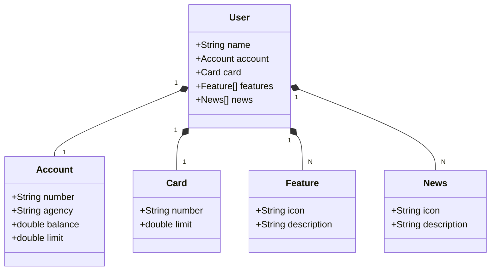
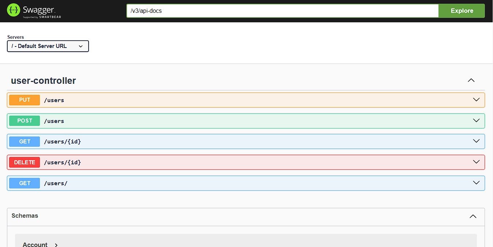

# API RESTful com Spring Boot

Este projeto é uma aplicação RESTful desenvolvida em parceria com a **DIO** e o **Santander**, com o objetivo de demonstrar boas práticas na criação de APIs robustas e escaláveis utilizando Java e Spring Boot.

## Visão Geral

A aplicação simula funcionalidades bancárias, incluindo gerenciamento de usuários, contas, cartões, recursos adicionais e notícias. Utiliza-se uma arquitetura baseada em modelos bem definidos e uma API intuitiva para consumir os dados.

---

## Diagrama de Classes

O diagrama abaixo representa a estrutura de classes da aplicação, mostrando os relacionamentos entre os principais componentes.



---

## Demonstração

  

*Exemplo da aplicação em execução com a interface funcional e responsiva.*

---

## Funcionalidades

- **Gerenciamento de Usuários:** Criação, leitura, atualização e exclusão de dados dos usuários.
- **Controle de Contas Bancárias:** Consulta de saldo, limite e informações da conta.
- **Gerenciamento de Cartões:** Consulta e gerenciamento de informações de cartões de crédito.
- **Recursos Adicionais:** Listagem e detalhamento de funcionalidades extras disponíveis para o usuário.
- **Notícias Bancárias:** Consulta de notícias e atualizações sobre o mundo financeiro.

---

## Tecnologias Utilizadas

- **Linguagem:** Java
- **Framework:** Spring Boot
- **Banco de Dados:** H2 (para testes) e suporte a bancos relacionais como PostgreSQL e MySQL
- **Documentação:** Swagger/OpenAPI
- **Testes:** JUnit e Mockito
- **Ferramentas:** Maven para gerenciamento de dependências

---

## Como Executar o Projeto

1. Clone este repositório:

   ```bash
   git clone https://github.com/Iago-Amorim/spring-restful
   ```

2. Acesse o diretório do projeto:

   ```bash
   cd spring-restful
   ```

3. Configure o ambiente:

   - Certifique-se de que o Java 17 e o Maven estão instalados.
   - Configure as variáveis de ambiente para o banco de dados, se necessário.

4. Inicie o servidor:

   ```bash
   mvn spring-boot:run
   ```

5. Acesse a documentação da API no navegador:

   - URL padrão: `http://localhost:8080/swagger-ui.html`

---

## Contribuições

Contribuições são bem-vindas! Siga os passos abaixo para contribuir com o projeto:

1. Faça um fork deste repositório.
2. Crie uma branch para a sua funcionalidade:
   ```bash
   git checkout -b minha-funcionalidade
   ```
3. Faça commit das suas alterações:
   ```bash
   git commit -m "Adiciona nova funcionalidade"
   ```
4. Envie para o repositório remoto:
   ```bash
   git push origin minha-funcionalidade
   ```
5. Abra um pull request no GitHub.

---

## Licença

Este projeto está licenciado sob a licença MIT. Consulte o arquivo `LICENSE` para mais detalhes.

---

## Créditos

Projeto desenvolvido como parte do programa de formação em Java da **Digital Innovation One (DIO)**, em parceria com o **Santander**.